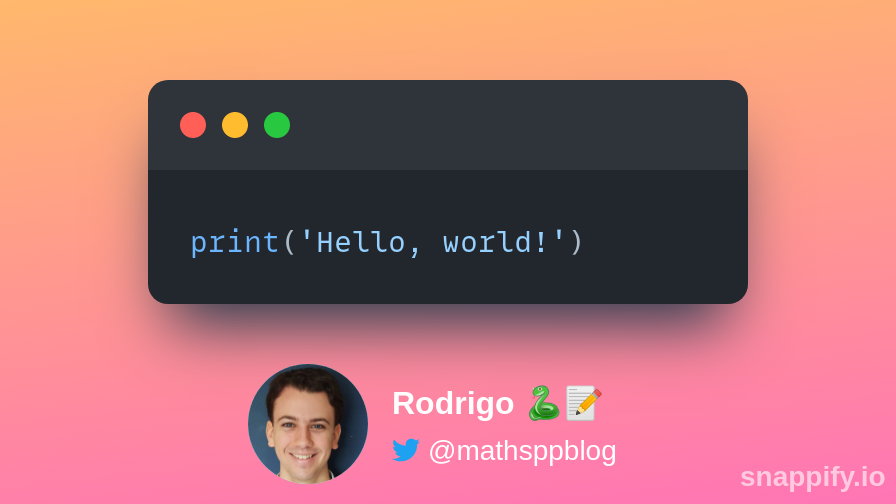

# sniped

`sniped` is a CLI tool that helps you turn code snippets into beautiful images.

## Example

```pwsh
sniped create snappify "print('Hello, world!')" --language Python --key snappify.key --out imgs/hello_world.png
```



## Usage

```console
$ sniped [OPTIONS] COMMAND [ARGS]...
```

**Options**:

* `--install-completion`: Install completion for the current shell.
* `--show-completion`: Show completion for the current shell, to copy it or customize the installation.
* `--help`: Show this message and exit.

**Commands**:

* `config`: Manage the configuration for the services.
* `create`: Create a beautiful image from a snippet of code.

### `sniped config`

Manage the configuration for the services.

**Usage**:

```console
$ sniped config [options] SERVICE:[carbon|snappify]
```

**Arguments**:

* `SERVICE:[carbon|snappify]`: [required]

**Options**:

* `--show / --no-show`: Print the configuration to stdout.  [default: False]
* `--pretty / --no-pretty`: Whether to use pretty printing or show plain output.  [default: True]
* `--write WRITE_PATH`: File to write default config to.
* `--help`: Show this message and exit.

### `sniped create`

Create a beautiful image from a snippet of code.

**Usage**:

```console
$ sniped create [options] SERVICE:[carbon|snappify] CODE_OR_PATH
```

**Arguments**:

* `SERVICE:[carbon|snappify]`: [required]
* `CODE_OR_PATH`: Code to include in the image or path to code file. Use '-' to read from stdin.  [required]

**Options**:

* `--language LANG`: Language for syntax highlighting; 'auto' only works for carbon.  [default: auto]
* `--key KEY_OR_PATH`: (Path to file with) API key for Snappify.
* `--out PATH`: Write to given file instead of stdout.
* `--theme THEME`: Theme to use for syntax highlighting.
* `--help`: Show this message and exit.


## Changelog

See the file [CHANGELOG.md](CHANGELOG.md).
